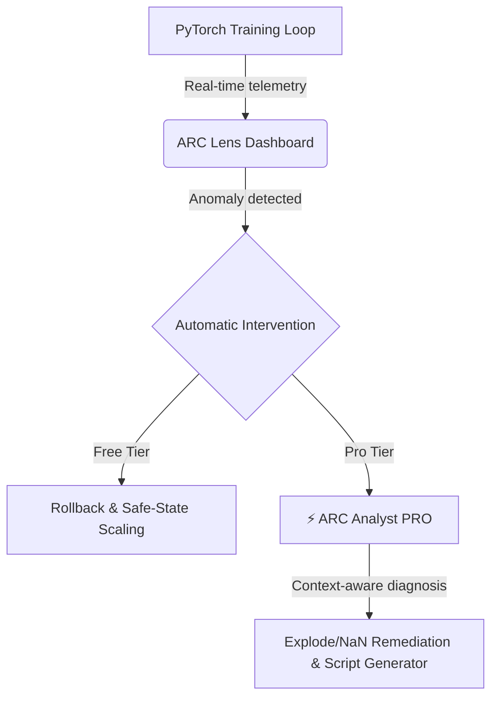
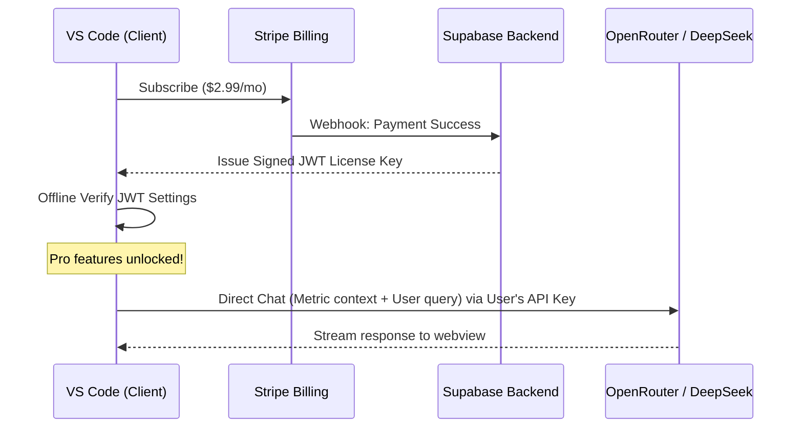

# ARC Lens — Comprehensive Business Plan & Monetization Model

> **Status:** Published & Finalized  
> **Date:** June 14, 2026  
> **Version:** 1.0.0  

---

## 1. Executive Summary

### The Problem
Machine Learning (ML) training is notoriously expensive, unstable, and time-consuming. Deep learning models frequently fail mid-run due to numerical instability:
* **Exploding/Vanishing Gradients:** Destabilizes weights, resulting in model degradation.
* **Loss NaNs:** Halts training completely, wasting hours of GPU/TPU compute.
* **Architecture Mismatches:** Misconfigured layer shapes or learning rate schedules cause silent failures or inefficient convergence.

Every failed run translates directly to **wasted cloud compute spend** (which can range from tens to thousands of dollars per run) and **lost developer productivity** as engineers manually trace telemetry and debug complex code.

### The Solution: ARC Lens
ARC Lens is a developer-first VS Code extension that serves as a **Self-Healing ML Trainer**. It acts as a real-time monitor, debugger, and intelligent assistant directly inside the IDE.



By connecting runtime telemetry (loss, gradient norms, weight update ratios, effective rank) with an LLM-powered intelligence layer, ARC Lens is the first tool to dynamically explain training failures and generate auto-corrected, ARC-instrumented code.

---

## 2. Market Opportunity & Competitive Landscape

### Target Market
* **Primary:** Core ML Engineers and Deep Learning Researchers (PyTorch/JAX users).
* **Secondary:** Data Scientists, AI/ML Students, and Laboratories running local/cloud training rigs (Colab, Kaggle, Lambda Labs, RunPod).

### Competitive Analysis

| Vector | TensorBoard | Weights & Biases | Cursor / Copilot | ARC Lens |
| :--- | :---: | :---: | :---: | :---: |
| **Telemetry Visuals** | ✅ Basic | ✅ Advanced | ❌ None | ✅ Real-time |
| **Failure Alerts** | ❌ None | ✅ Static | ❌ None | ✅ Intelligent |
| **Self-Healing / Auto-Rollback** | ❌ None | ❌ None | ❌ None | ✅ Yes |
| **Context-Aware Chat** | ❌ None | ❌ None | ✅ Code only | ✅ Code + Run Metrics |
| **Script Generation** | ❌ None | ❌ None | ✅ General | ✅ ARC-Tested Hook Template |

---

## 3. Product & Feature Tiers

ARC Lens is distributed on a freemium model designed to drive bottom-up developer adoption while keeping customer acquisition cost (CAC) near zero.

```
                  ┌─────────────────────────────────────┐
                  │              FREE TIER              │
                  ├─────────────────────────────────────┤
                  │ • Real-time telemetry dashboard     │
                  │ • Auto-rollback & recovery loops    │
                  │ • Chart image downloads (PNG)       │
                  └──────────────────┬──────────────────┘
                                     │ (Developer locks / upgrade prompt)
                                     ▼
                  ┌─────────────────────────────────────┐
                  │              PRO TIER               │
                  ├─────────────────────────────────────┤
                  │ • ⚡ AI Failure Analyst Chat        │
                  │ • 🛠 ARC Script Generator (tested)  │
                  │ • Deep telemetry trend explanation │
                  └─────────────────────────────────────┘
```

### Free Tier ($0/month)
* **Real-Time Dashboard:** Low-overhead chart tracking of loss, learning rates, gradient norms, update ratios, and effective rank.
* **Auto-Intervention:** Automatically saves state, rolls back to non-exploding steps, and applies gradient clipping / learning rate decay to prevent NaNs.

### Pro Tier ($2.99/month)
* **⚡ AI Failure Analyst:** A context-aware chatbot loaded with live telemetry history and current scripts to explain *why* training failed and suggest remediation.
* **🛠 ARC Script Generator:** Form-to-code generator that creates PyTorch boilerplate pre-instrumented with ARC recovery hooks, fully tested for execution before delivery.

---

## 4. Monetization & Business Model

ARC Lens uses a **Hybrid Subscription + BYOK (Bring Your Own Key) SaaS Model**. This is a highly strategic, developer-friendly architecture designed to maximize profit margins.

> [!NOTE]
> **The BYOK (Bring Your Own Key) Advantage**
> Under a standard SaaS model, the software vendor pays for LLM token usage, risking negative unit economics from "power users" who run thousands of chat queries. 
> By requiring users to paste their **OpenRouter API Key**, ARC Lens offloads 100% of LLM compute and token costs. 
> The **$2.99/month** subscription represents a pure software licensing fee with **near-100% gross margins**.

### Detailed Pricing Architecture

| Component | Free Tier | Pro Tier ($2.99/mo) |
| :--- | :---: | :---: |
| **Cost to Developer** | $0 | $2.99/month |
| **LLM Access Model** | None | BYOK (User supplies OpenRouter key) |
| **Query Limitations** | None | Unlimited (governed by user's API keys) |
| **LLM Model Utilized** | — | DeepSeek V3 / V4 Pro |
| **Cost to ARC (Marginal)** | $0 | **$0** (zero token liability) |

### The Payment & Licensing Stack
* **Stripe:** Manages payment processing, user subscriptions, and invoicing.
* **Supabase Database:** Stores license metadata (user ID, Stripe ID, activation keys).
* **JWT (JSON Web Token):** Generated upon successful Stripe checkout, containing license details and expiration dates.
* **Offline Validation:** The VS Code extension performs local cryptographic JWT checks, eliminating the need for database round-trips on every startup.

---

## 5. Technical Architecture & Data Security



### Data Privacy & Consent
AI tools often face resistance in enterprise settings due to data leakage concerns. ARC Lens implements a **privacy-first data policy**:
* **Direct Connections:** Chat queries are routed directly from the user's IDE to OpenRouter. No middleman proxy collects code or metric payloads.
* **Consent-Based Context:** Scripts are only attached to LLM prompts if the user checks the *"Include script context"* box.
* **Anonymized Metrics:** Numerical metric logs (loss curves) do not contain proprietary information.

---

## 6. Financial Projections

### Unit Economics
* **Monthly Subscription Fee:** $2.99
* **Stripe Transaction Fee (approx. 2.9% + $0.30):** $0.39
* **Database & Hosting Overhead (amortized per active user):** $0.05
* **Net Profit per User / Month:** **$2.55 (85.2% Net Margin)**

### 3-Year Growth & Revenue Projection

| Metric | Year 1 | Year 2 | Year 3 |
| :--- | :---: | :---: | :---: |
| **Active Free Users** | 10,000 | 50,000 | 200,000 |
| **Conversion Rate (Free → Pro)** | 2.0% | 2.5% | 3.0% |
| **Active Pro Subscribers** | 200 | 1,250 | 6,000 |
| **Annual Recurring Revenue (ARR)** | **$7,176** | **$44,850** | **$215,280** |
| **Stripe Fees & Infrastructure** | $1,056 | $6,600 | $31,680 |
| **Net Operational Profit** | **$6,120** | **$38,250** | **$183,600** |

---

## 7. Go-To-Market (GTM) Strategy

To drive fast developer acquisition without capital expenditure:
1. **VS Code Marketplace SEO:** Optimize titles, tags, and descriptions around terms like "PyTorch," "NaN Loss," "Gradient Explode," and "TensorBoard Alternative."
2. **Kaggle & Colab Notebook Templates:** Publish open-source notebook templates with pre-configured `arc-training` telemetry hooks, linking back to the VS Code extension.
3. **Developer Content Marketing:** Write highly technical blog posts dissecting complex ML failure modes (e.g., *"How to Debug Vanishing Gradients in Transformer Architectures"*) showcasing how ARC Lens solves it in 1 click.
4. **Open-Source Core Integration:** Maintain the telemetry loop package (`arc-training`) as open source on PyPI, building brand trust and organic referrals.

---

## 8. Risks & Mitigations

### 1. Market Penetration & BYOK Friction
* *Risk:* Developers find copying/pasting an OpenRouter API key too tedious.
* *Mitigation:* Offer a pre-configured starter pack with $0.50 of free trial credit, or provide a simple, illustrated guide to setting up an OpenRouter key in under 60 seconds.

### 2. Marketplace Security & Compliance
* *Risk:* Manifest changes or telemetry features flagging automated store reviews.
* *Mitigation:* Ensure strict compliance with VS Code extension guidelines by avoiding dynamic execution of external scripts, sanitizing package manifests, and keeping all logic transparently compiled.

### 3. Model Dependency
* *Risk:* Price changes or depreciation of specific models on OpenRouter.
* *Mitigation:* Design the LLM connection to be agnostic. Using the settings panel, users can select any compatible model (e.g., DeepSeek, Claude, GPT-4o) using standard endpoint overrides.
